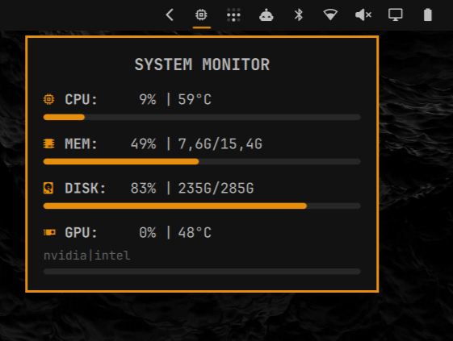
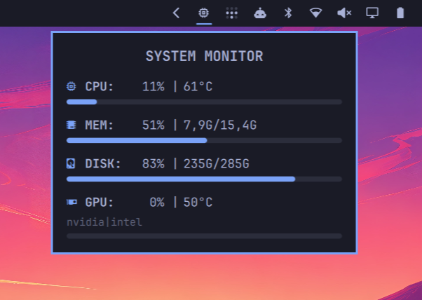
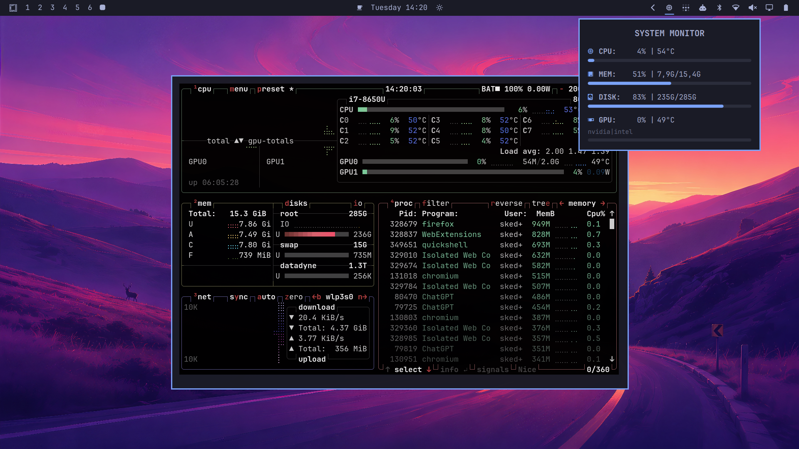

# System Monitor for Omarchy

A simple and lightweight system-monitor widget for Omarchy.

Hover the bar icon for live telemetry. Click the icon or the balloon to open `btop`.

## Screenshots

<p align="center">
  
  
  
</p>

## Install

```sh
omarchy plugin add https://github.com/Skedar/omarchy-system-monitor-plugin.git --enable
omarchy-restart-shell
```

## Update

```sh
omarchy plugin update io.github.skedar.system-monitor
omarchy-restart-shell
```

## Remove

```sh
omarchy plugin remove io.github.skedar.system-monitor
```

## What it does

- Hover the bar icon to show the monitor balloon.
- Updates CPU, memory, root-disk (`/`), and GPU telemetry every two seconds while the balloon is visible.
- Shows CPU/GPU usage and temperature, memory usage and used/total capacity, and root-disk usage and used/total capacity.
- Detects Intel, AMD, and NVIDIA GPUs. Hybrid systems are displayed compactly, for example: `intel|nvidia`.
- Left-click the icon or balloon to open `btop` in Omarchy's floating, centered terminal window.
- Right-click anywhere in the balloon to close it immediately.
- Follows the active Omarchy theme automatically.

## Compatibility and Deps

- Omarchy >4.
- Linux systems with standard `/proc`, `/sys`, and `df` telemetry sources.
- NVIDIA utilization and temperature require `nvidia-smi`; the widget remains functional when it is unavailable.
- Need btop installed to show full system monitor with left click.
- No root access, external service, or second Quickshell instance is required.

## Support

If this plugin is useful to you, support its development:

- [Buy Me a Coffee — Skedar](https://buymeacoffee.com/Skedar)
- [Skedar's GitHub Pages](https://skedar.github.io/) 
